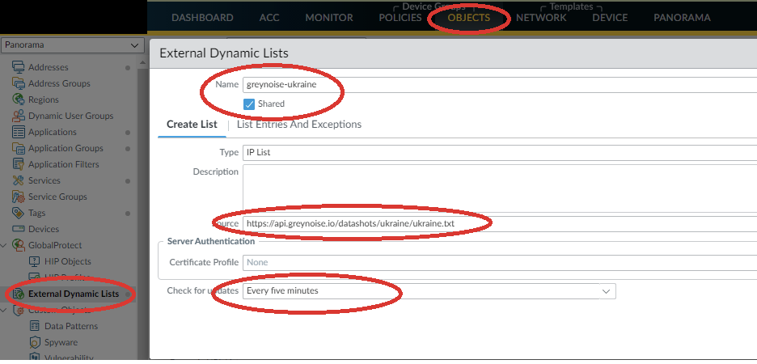
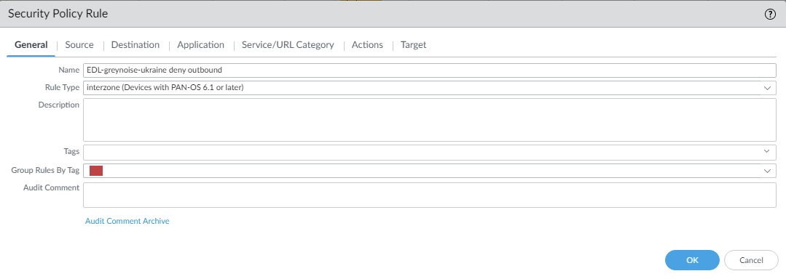
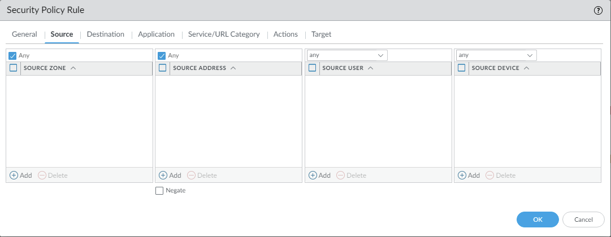
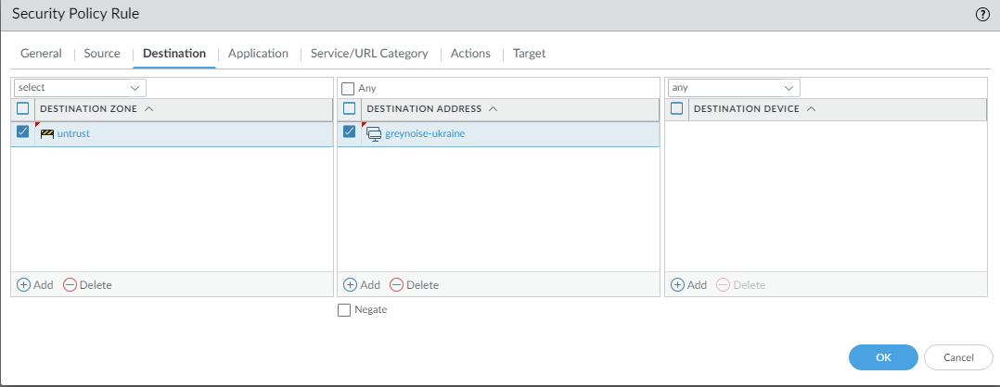
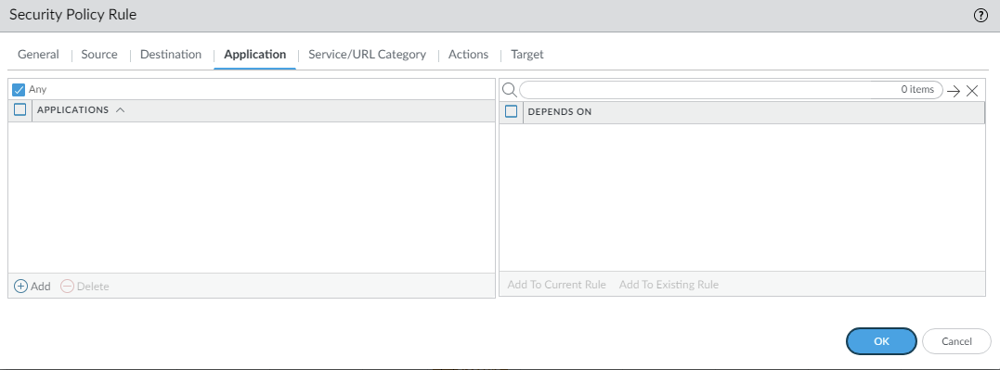
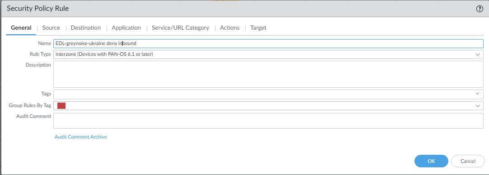
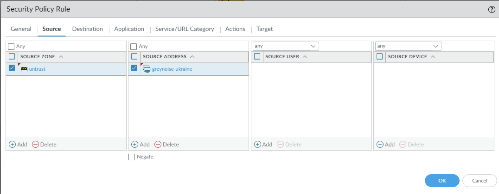
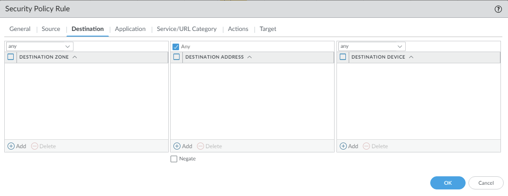
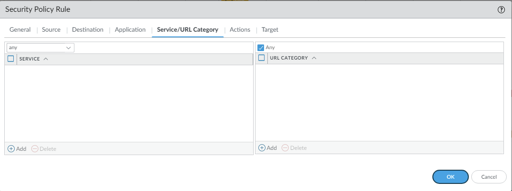

## Which IP blocklist to use

* If you want to block all non-spoofable IPs reported by [Grey Noise](https://www.greynoise.io/) to be targeting only Ukranian IP space, use [https://api.greynoise.io/datashots/ukraine/ukraine.txt]().
* If you want to also block spoofable IPs, use [spoofable_all.txt](https://tjclement.github.io/ukraine-defense-firewall-rules/main/palo-alto/spoofable_all.txt.txt) from this folder.
* For only IPs marked as scanning for active vulnerabilities, use `*_malicious.txt` from this folder.

## Blocking IPs on Palo Alto firewalls

Here's how to set up dynamic blocklists from external text files on Palo Alto:

### Via Panorama management system CLI
(adjust device-group to correct name and adjust certificate profile if needed)
```
set device-group "[device-group]" pre-rulebase security rules "EDL-greynoise-ukraine deny outbound" destination greynoise-ukraine
set device-group "[device-group]" pre-rulebase security rules "EDL-greynoise-ukraine deny inbound" source greynoise-ukraine
set shared external-list greynoise-ukraine type ip recurring five-minute
set shared external-list greynoise-ukraine type ip url https://api.greynoise.io/datashots/ukraine/ukraine.txt
set shared external-list greynoise-ukraine type ip certificate-profile None
```

### Via standalone CLI
```
set rulebase security rules "EDL-greynoise-ukraine deny outbound" destination greynoise-ukraine
set rulebase security rules "EDL-greynoise-ukraine deny inbound" source greynoise-ukraine
set external-list greynoise-ukraine type ip recurring five-minute
set external-list greynoise-ukraine type ip url https://api.greynoise.io/datashots/ukraine/ukraine.txt
set external-list greynoise-ukraine type ip certificate-profile None
```

### Via web interface











